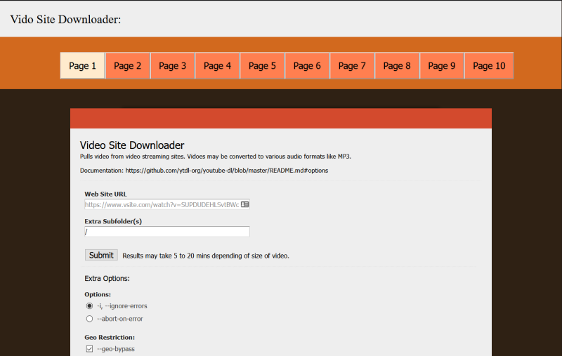
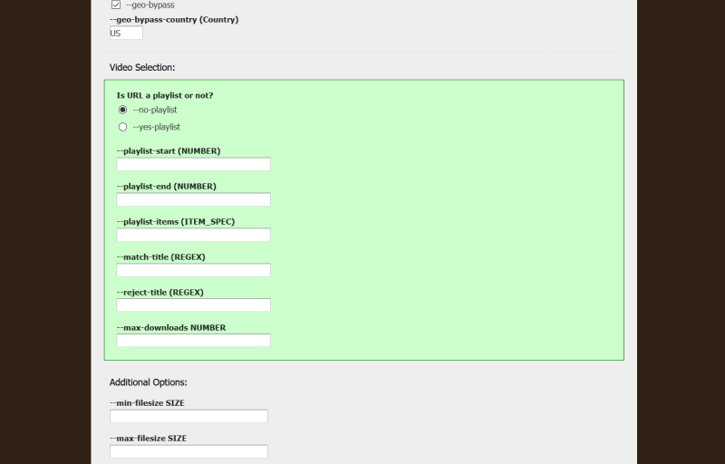
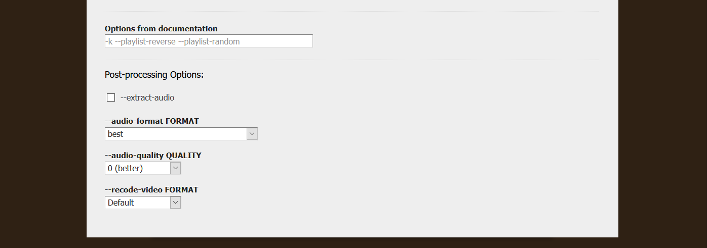
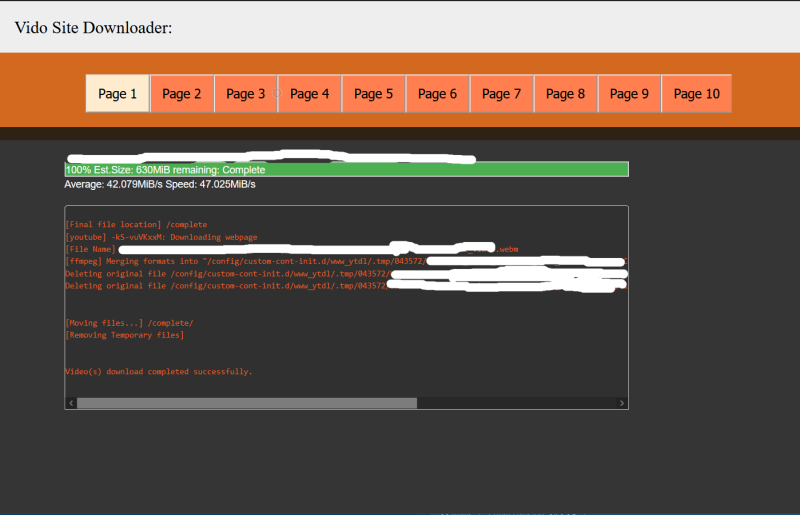

# docker-youtube-dl-webpage

This is an add-on to /linuxserver/docker-nginx which will present users with a web interface to youtube-dl.

I created this project for myself. The bash scripting is NOT great. The PHP will make you cry,
and the HTML/CSS will make your eyse bleed. 

https://github.com/linuxserver/docker-nginx

This script will configure  linuxserver/docker-nginx  
to run as a youtube-dl docker.

## Installation

create, run, and stop the  linuxserver/docker-nginx 
like such:

```
UID=$(id -u) && GID=$(id -g)

appName="ytdl"

f_cfg=<location/folder/config>/${appName}
#where to look for container config files

f_dest=<location/folder/complete>/complete 
#where to look for downloaded content

mkdir -p "${f_cfg}"/${appName}
git clone https://github.com/tserversbfs/docker-youtube-dl-webpage.git "${f_cfg}"/${appName}

docker create \
     --name=${appName} \
     --net=app_net \
     -e PUID="${UID}" \
     -e PGID="${GID}" \
     -e TZ=Europe/Paris \
     -v "${f_cfg}"/${appName}:/config \
     -v ${f_dest}/complete:/complete \
     --restart unless-stopped \
     ghcr.io/linuxserver/nginx 

```

## Usage

Use apache2 or nginx and reverse-proxy to port 80 or 443.

## Main page
<br/>
<br/>


## Completed page


## Contributing
Pull requests are welcome. For major changes, please open an issue first to discuss what you would like to change.

Please make sure to update tests as appropriate.

## License
[MIT](https://choosealicense.com/licenses/mit/)
